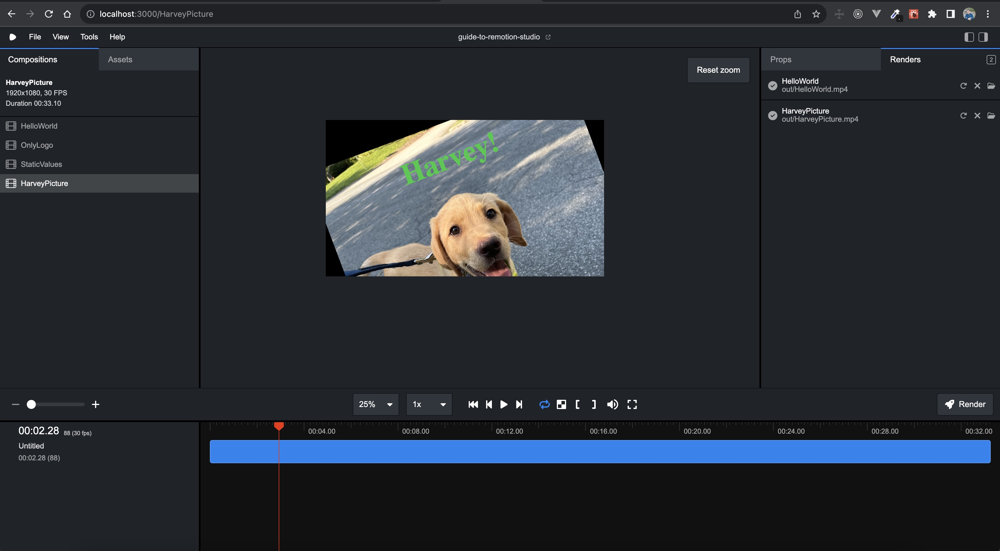

# Guide to Remotion Studio

This project accompany's my upcoming blog post on Remotion Studio. The project includes 4 compositions that showcase using a Zod Schema for composition props to include:

1. `HelloWorld`

- copied from a starter project, shows text and an image

2. `OnlyLogo`

- copied from a starter project, has a React logo that can be color changed

3. `StaticValues`

- demonstrates Zod properties you can add to your compositions

4. `HarveyPicture`

- shows how you can bring in an asset image and dynamically change it with Zod

If you want to run this project, do an initial `npm install` and then run `npm run start` to see the Remotion Studio in action.

I recommend checking out [the Remotion Studio docs](https://www.remotion.dev/docs/) for more information.
